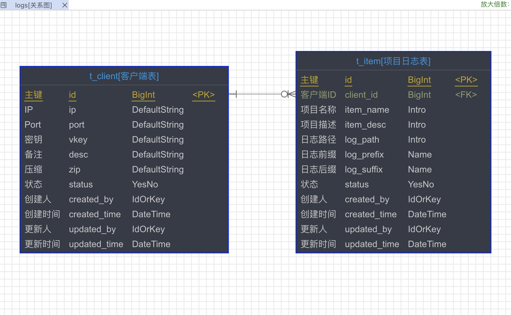
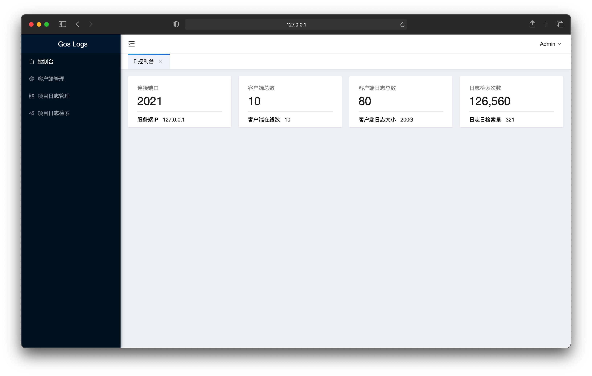

## gos-log
基于Go语言的轻量级高性能的分布式日志系统

## logc 客户端
1. 服务注册功能（项目启动后，输入服务端ip、port、vkey）
2. 日志查找功能（查找、生成临时文件、压缩临时文件、回掉服务端上传接口）
3. 健康检查功能（每5分钟和服务端通信一次，检测和更新自己的注册状态）

## logs 服务端
1. 默认用户登陆后台
2. 新增客户端名称生成客户端IP、port、vkey
3. 新增客户端项目名称、备注、项目日志路径、日志名规则
4. 日志查找功能（用户选择客户端、项目、日志日期，输入关键字 点击查找即可下载）

## 备注说明
1. 先启动服务端再启动客户端
2. 一台客户端服务器对应唯一一个服务端后台客户端配置

## 项目截图
### 关系图

### 登陆页

### 控制台

### 客户端

### 项目管理

### 日志查找

