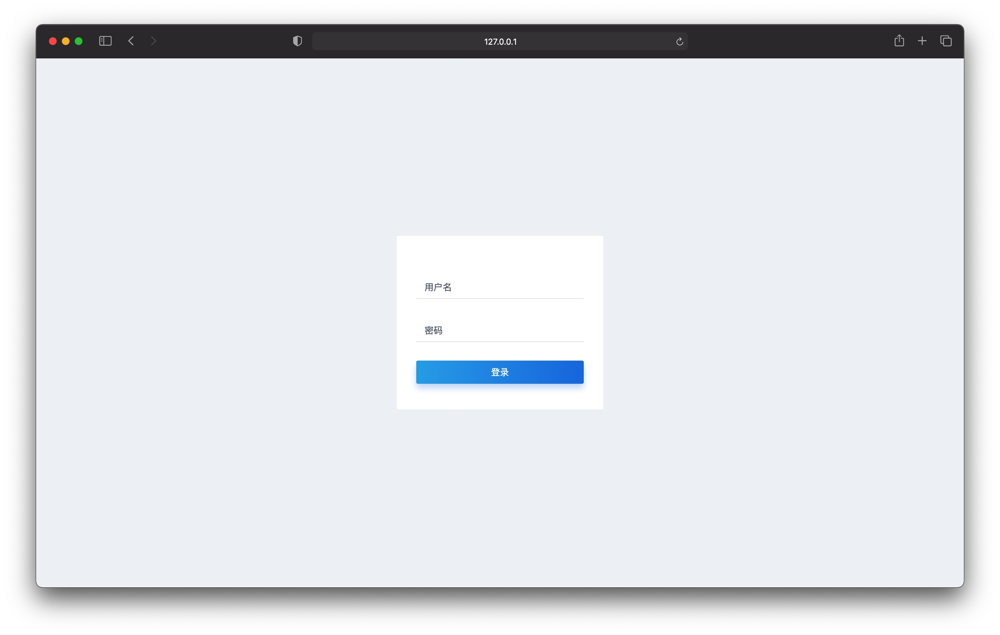
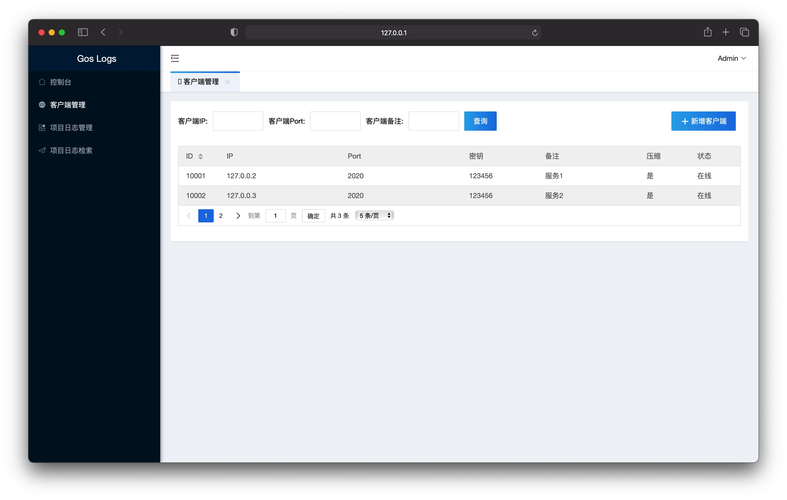
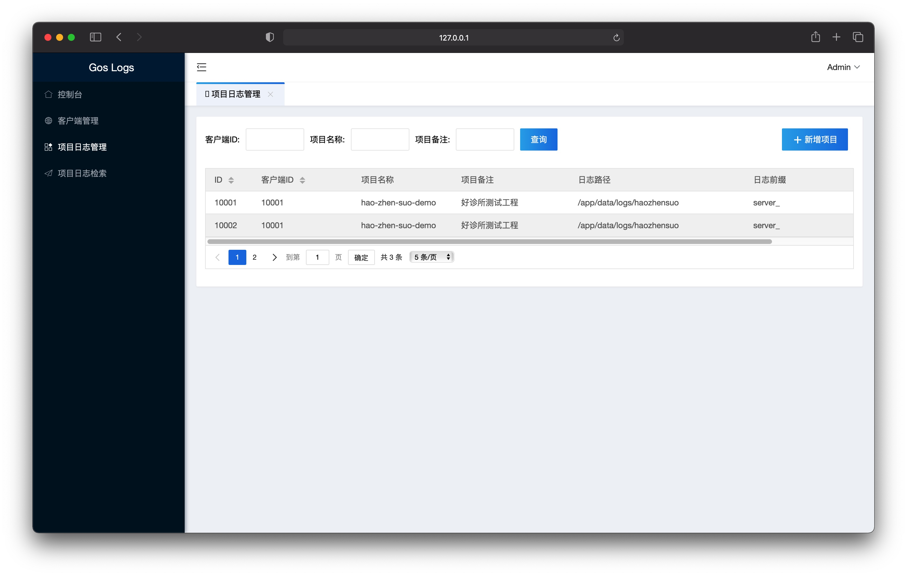
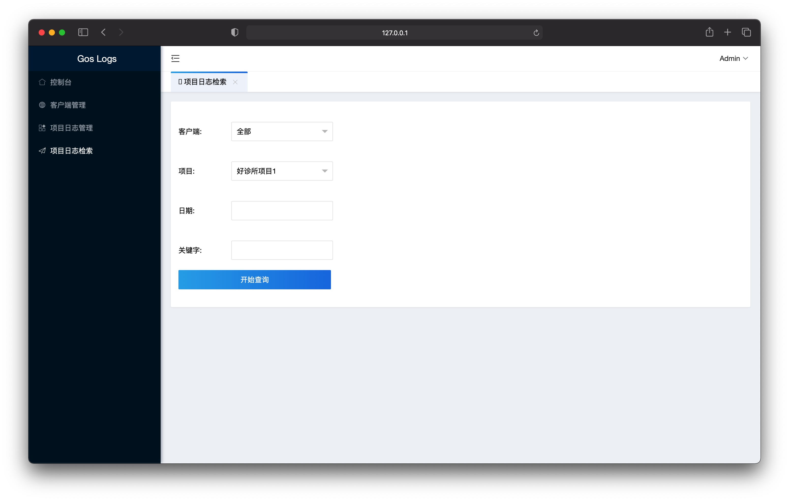

## gos-log
基于Go语言的轻量级高性能的大日志检索系统

## 开源地址

### gos-log

https://gitee.com/dianjiu/gos-log

https://github.com/dianjiu/gos-log

### gos-log-vue

https://gitee.com/dianjiu/gos-log-vue

https://github.com/dianjiu/gos-log-vue

## 演示地址

http://goslog.dianjiu.org.cn

账号：admin
密码：admin

## 演示截图
### 登陆页

### 客户端

### 项目管理

### 日志查找



## 项目构建

### gos-log

```shell
# 进入go工作空间
cd ~/codes/go/src
# 配置go国内代理
sudo vim ~/.bash_profile
# 新增如下内容 
export GOPATH=/Users/dianjiu/Codes/go
export GOROOT=/usr/local/go
export GOBIN=$GOPATH/bin
export PATH=$PATH:$GOROOT/bin:$GOPATH/bin
export GOPROXY=https://goproxy.cn
export GO111MODULE=on
# 使配置生效
source ~/.bash_profile
# 安装beego依赖
go get github.com/astaxie/beego
go get github.com/beego/bee
# 克隆项目
git clone https://github.com/dianjiu/gos-log.git
# 分别进入项目目录
cd gos-log/logs		#进入服务端
cd gos-log/logc		#进入客户端
# 启动服务
bee run
```

### gos-log-vue

```shell
# 克隆项目
git clone https://github.com/dianjiu/gos-log-vue.git

# 进入项目目录
cd gos-log-vue

# 安装依赖
yarn install

# 启动服务
yarn run dev
```


## 项目部署

### gos-log

```shell
# 打包服务端
cd gos-log/logs
bee pack -be GOOS=linux
# 打包客户端
cd gos-log/logc
bee pack -be GOOS=linux
# 准备数据库 见gos-log项目下的sql文件夹
```

### gos-log-logs

```shell
# 解压缩
tar -zxf logs.tar.gz -C ./ 
# 授权
chmod 777 logs 
# 修改数据库配置
sudo vim conf/app.conf 
# 启动
nohup ./logs >> logs.log & 
```

### gos-log-logc

```shell
# 解压缩
tar -zxf logc.tar.gz -C ./ 
# 授权
chmod 777 logc 
# 启动
nohup ./logc >> logc.log & 
```

### gos-log-vue

```shell
# 打包构建
yarn run build
# 把dist目录下的文件拿到服务器部署即可
# nginx部署如下nginx.conf
server {
	listen       2022;
	server_name  localhost;

	location / {
		root /web/gos-log/vue;
		index  index.html index.htm;
		try_files $uri $uri/ /index.html; 
	}
	location /api {
		rewrite  ^/api/(.*)$ /$1 break;
		proxy_pass http://127.0.0.1:2021;
	}
}
```

## 更新日志

### **V2.0.0**

- [x] 1、优化压缩算法、解决压缩包路径过长问题

- [ ] 2、优化并行查询速度，查询全部服务器理论耗时于单台服务相当

- [ ] 3、实现客户端启动即注册，及服务端健康检查功能

- [ ] 4、优化向下截取行可输入，解决默认1000行有时不够用的问题

- [ ] 5、增加安全性，服务端所有接口实现token验证，客户端仅支持注册的服务端进行调用

- [ ] 6、有机会的话做一下权限管理，不同的用户（即不同的部门成员）仅可看到和查询该部门客户端下的服务器日志

### **V1.0.0**

- [x] 1、基于bufio实现高性能的日志检索算法

- [x] 2、基于beego实现服务端客户端分离设计

- [x] 3、基于vue2.0实现服务端前后端分离设计

- [x] 4、基于DBMan实现数据库表关系设计

- [x] 5、实现多种数据库适配，支持MySQL、PostgreSQL

- [x] 6、实现服务端的登陆登出功能

- [x] 7、实现服务端的客户端增删改查、分页、注册接口

- [x] 8、实现服务端的项目日志的增删改查、分页接口

- [x] 9、实现服务端的项目日志单台和全部客户端的查询

- [x] 10、实现客户端的日志检索功能

- [x] 11、实现客户端的服务注册功能

## 性能测试

### **系统硬件**

| CPU       | Intel® Core™ i5-10210U CPU @ 1.60GHz × 8 |
| --------- | ---------------------------------------- |
| 内存      | 16G                                      |
| 硬盘      | 512.1 GB                                 |
| 操作系统  | Ubuntu 20.04.2 LTS 64位                  |
| GNOME版本 | 3.36.8                                   |

### **系统环境**

| Java环境   | ORACLE JDK13.0.2     |
| ---------- | -------------------- |
| Go环境     | GO1.15.7 linux/amd64 |
| Python环境 | Python 3.8.5         |

### 性能对比

单文件逐行读取  17.8G test.log (单线程读取)

| 语言   | test1            | test2  | test3  | test4  | test5  | 总耗时  | 平均耗时 |
| ------ | ---------------- | ------ | ------ | ------ | ------ | ------- | -------- |
| Go     | 32.99s           | 34.24s | 30.33s | 31.21s | 35.70s | 164.16s | 32.83s   |
| Python | 32分钟还没执行完 |        |        |        |        |         |          |
| Java   | 226s             | 206s   | 153s   | 219s   | 183s   | 987s    | 197.4s   |

## 关于点九

### 个人站点

http://dianjiu.co/

### 个人邮箱

dianjiu@dianjiu.cc

## 项目致谢


